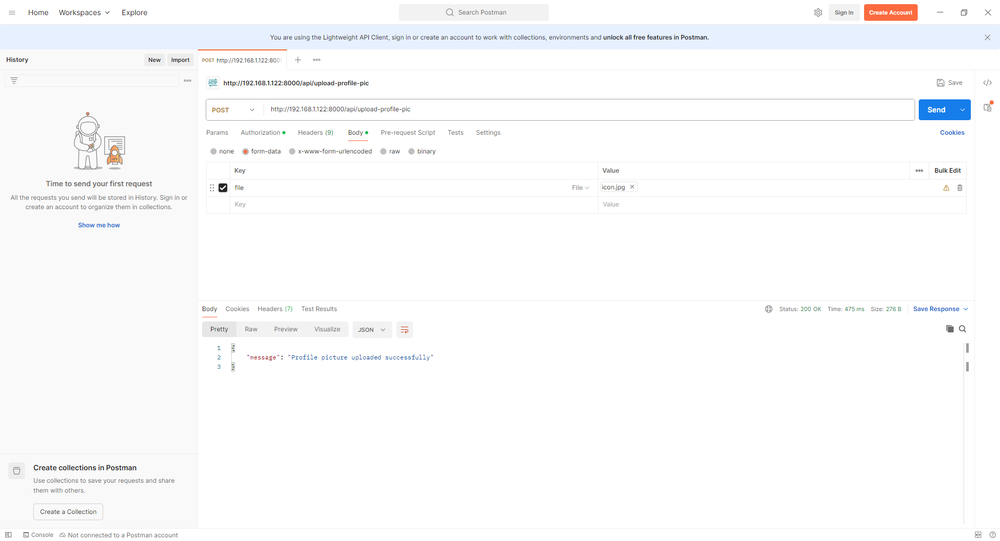

POST -> http://192.168.1.122:8000/api/upload-profile-pic

Authorization -> Bearer Token 

2|Jhm5ayeP1z2g57MtUckAQLEMXQA2u07S111bK9Sg4a7cf9d4

- **Body:** 
  - Select **form-data**
  - Key: `file` (Type: File)
  - Value: Choose an image file (`jpeg`, `png`, `jpg`, or `gif`)

Response

{
    "message": "Profile picture uploaded successfully"
}

